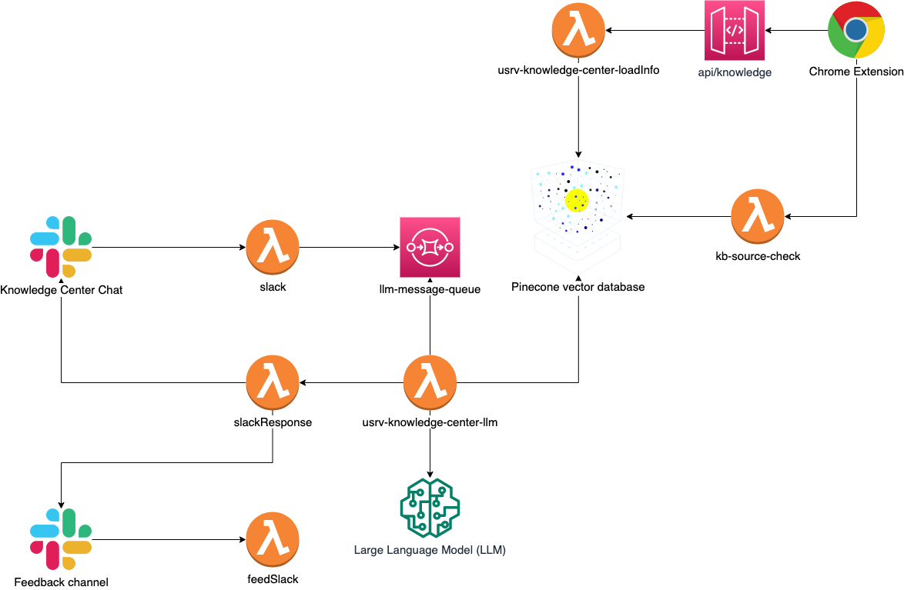

# Kushki Knowledge Center

## Descripción del Proyecto

La aplicación Kushki Knowledge Center es una solución basada en Slack y LLMs que permite a los empleados de la empresa de pagos Kushki colaborar y acceder a una base de conocimientos compartida. Esta herramienta mejora la eficiencia y la comunicación al proporcionar un espacio centralizado para almacenar, buscar y compartir información relevante.

## Características Principales

- **Colaboración en Tiempo Real**: Los empleados pueden compartir y actualizar información en tiempo real, fomentando la colaboración y la creación colectiva de conocimiento.
- **Integración con Slack**: La aplicación se integra de manera nativa con Slack, lo que facilita la incorporación y el uso por parte de los empleados.

## Diagrama de Arquitectura

